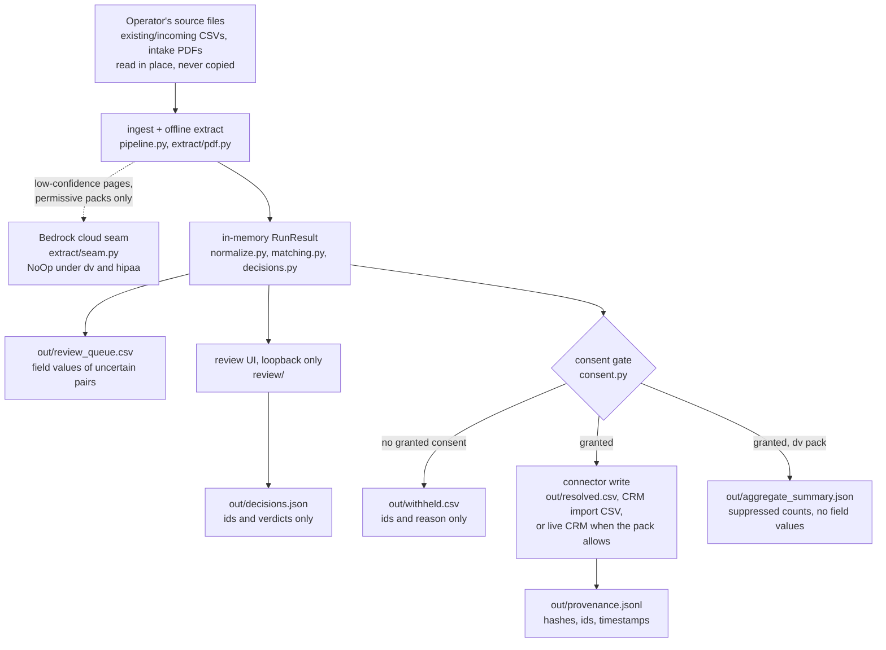

# Data flow and retention

The data-flow map and the per-pack retention and destruction model for
constituent-reconciler. This is the R8 deliverable from
[RESEARCH-ROADMAP.md](./RESEARCH-ROADMAP.md): it names every artifact the
pipeline reads or writes, says which of them hold individual records, and
defines what each policy pack expects an operator to retain and to destroy.

The posture matches [ADOPTION-KIT.md](./ADOPTION-KIT.md): this is a reference
implementation, not legal advice. The model below defines what must be
destroyable and in what order, not how long anything is kept. Retention windows
depend on funding stream, state law, and the adopting organization's own
policies, and are the organization's and its counsel's to set.

Status: model defined. Destruction is a manual procedure today; the planned
automation is EXP-10 in `docs/ideation/03-expansions.md` (a `reconcile destroy`
command that executes this model and logs destruction to the provenance chain).

## Part 1: the data-flow map

Source data enters through the readers in `pipeline.py`: CSVs via
`read_records`, intake PDFs via `read_pdf_records` and the offline extractor in
`extract/pdf.py`. Inputs are read in place and never copied; the tool holds no
staging copy of the source files.

Normalization (`normalize.py`), pair scoring (`matching.py`), banding,
clustering, and golden-record reduction (`decisions.py`) all happen in memory.
`pipeline.run` returns a value and writes nothing, which is why a dry run can
produce the same result without touching disk. Everything durable lands in the
output directory passed as `--out`.

Two paths can move data off the machine, and both are policy-gated:

* The optional cloud extraction seam (`extract/seam.py`) may send a
  low-confidence PDF page to Claude via Amazon Bedrock when the recipe enables
  it. Under the `dv` and `hipaa` packs the seam is constructed as a no-op
  before any data flows, enforced by `tests/test_no_egress.py`.
* The live CRM connectors (`connectors/civicrm.py`, `connectors/salesforce.py`)
  push resolved records to a remote system. Under a pack that requires local
  targets (`dv`), `pipeline.build_connector` refuses them fail-closed.

The review UI (`reconcile review`) serves field values over loopback HTTP for
display, and under the `dv` pack a non-loopback bind is refused. Its only
side effect on disk is `decisions.json`, which carries record ids and verdicts
and no field values (`review/session.py`).

### Artifact inventory

Every artifact below was checked against the writer named for it; nothing in
this table is aspirational.

| Artifact | Written by | Where it lives | Holds individual records? | Notes |
| --- | --- | --- | --- | --- |
| Source CSVs and intake PDFs | the operator; read by `pipeline._ingest_source` | wherever the operator keeps them | Yes | Read in place. Destruction of inputs is the operator's procedure, not the tool's. |
| `review_queue.csv` | `pipeline._write_review_queue` | the `--out` directory | Yes: field values of both records in every uncertain pair, plus source spans when extracted | Written on every `reconcile run`, including `--dry-run`. |
| `resolved.csv` | `connectors/csv_out.py` | the `--out` directory | Yes: golden-record field values, member ids, consent | The default write target. Skipped on `--dry-run`. |
| `civicrm_import.csv`, `salesforce_import.csv` | `connectors/crm_csv.py` | the `--out` directory | Yes: import-shaped field values | Local files, so permitted under the `dv` pack. Skipped on `--dry-run`. |
| Live CRM records | `connectors/civicrm.py`, `connectors/salesforce.py` | the remote CRM | Yes | Non-local; refused fail-closed under the `dv` pack (`pipeline.build_connector`). |
| `withheld.csv` | `pipeline._write_withheld` | the `--out` directory | Ids only | Cluster id, member record ids, reason. No field values, but ids resolve to people through the organization's own systems. |
| `decisions.json` | `review/session.py` | the `--out` directory | Ids only | Pair ids and verdicts. No field values, by design. |
| `provenance.jsonl` | `provenance.py` | the `--out` directory | No field values | Each entry: BLAKE2b hash of the written payload, record and member ids, consent flag, timestamp, chain hashes. Payloads are referenced by hash, never stored. |
| `aggregate_summary.json` | `pipeline._write_aggregate_summary` over `suppression.py` | the `--out` directory | No | Total and suppressed category counts. Written only under a pack with `aggregate_export` (the `dv` pack), and not on `--dry-run`. |
| `eval/report.md` | `report.py` via `reconcile eval` | the path given to `--out` | No | Match-quality rates on seeded synthetic fixtures; the fixtures contain no real personal data. |
| Terminal output | `report.render_run_summary`, `suppression.render_summary` | the operator's terminal | No | Per-stage counts and the suppressed aggregate. |
| Cloud seam egress | `extract/seam.py` | Amazon Bedrock | Yes, when enabled | Low-confidence PDF pages only. A no-op under `dv` and `hipaa`, asserted by `tests/test_no_egress.py`. |

## Part 2: retention and destruction per policy pack

The model for each pack says which artifacts must be routinely destroyable,
which may be retained, and what triggers destruction. It deliberately does not
set the retention window. "How long" is a counsel and funder question; the
repo's contribution is that when the answer arrives, the artifacts sort cleanly
into destroy and retain with nothing ambiguous between them.

### default

The default pack enforces no confidentiality invariants beyond the ordinary
fail-closed gate (`policy.py`), so retention is governed entirely by the
organization's existing records schedule. The model:

* `review_queue.csv`, `resolved.csv`, and the CRM import CSVs carry the same
  personal data as the source CRM export they came from. Put them under the
  same schedule as that export, and delete the output directory once a run's
  results have been applied.
* `provenance.jsonl`, `decisions.json`, and `withheld.csv` hold ids and hashes
  rather than field values and may outlive the record artifacts, which is what
  lets the audit trail survive routine cleanup.
* `make clean` removes the demo output directories. It is a developer
  convenience, not a destruction control.

### dv (VAWA and FVPSA)

The HUD HMIS Comparable Database Manual expects individual survivor records to
be routinely destroyed once no longer needed, and NNEDV Safety Net guidance
reads the confidentiality obligations the same way. Both sources are cited with
their limits in [RESPONSIBLE-TECH-AUDITS.md](./RESPONSIBLE-TECH-AUDITS.md) and
[RESEARCH-ROADMAP.md](./RESEARCH-ROADMAP.md). Under this pack the model is:

**Destroy routinely.** The output-directory artifacts that hold individual
records are `review_queue.csv` and `resolved.csv` (or the CRM import CSV when
one is used). Destroy them once their purpose is served: the resolved records
have landed in the organization's comparable database and the review decisions
have been applied. `withheld.csv` and `decisions.json` hold record ids without
field values, but those ids resolve to survivors inside the organization's own
systems, so they go on the same destruction schedule. Source intake files are
destroyed under the organization's own intake procedure.

**Retain.** `aggregate_summary.json` may be kept: it is already
non-identifying, small cells are suppressed (`suppression.py`), and it is the
one artifact the pack treats as shareable, so it supports funder reporting
after the record artifacts are gone. `provenance.jsonl` should be kept:
entries reference each written payload by BLAKE2b hash and never store field
values, so the log proves what was written, when, and under which consent
without being able to regenerate a destroyed record. Keep the log local all the
same. It contains record ids, and a hash over a low-entropy payload can in
principle be confirmed by guessing, so the log is evidence for the
organization's own audits, not a shareable artifact.

**Trigger.** What "no longer needed" means differs across VAWA, FVPSA, and
VOCA funding and across states. The pack defines the destroy/retain sort and
the order of operations; the window is counsel-gated, consistent with the
jurisdiction note in [RESEARCH-ROADMAP.md](./RESEARCH-ROADMAP.md).

**Execution.** Today destruction is manual: delete the destroy-list artifacts
above and keep the two retained ones. EXP-10 in
`docs/ideation/03-expansions.md` scopes the automation, a `reconcile destroy`
command that deletes record-bearing artifacts older than a stated policy and
appends a destruction entry naming artifact hashes to the provenance chain, so
the chain proves destruction without retaining content. One honest limit
applies either way: deleting a file is not forensic erasure on a journaling
filesystem. Full-disk encryption on the machine that runs the tool is the
practical mitigation until something stronger is warranted.

### hipaa

The `hipaa` pack turns on the consent gate and fuses the cloud seam off, and
`policy.py` records that its fuller invariant set is deliberately unspecified.
This document holds to the same line: no HIPAA retention or destruction
obligation is stated here, because the repo's ground rule is that compliance
facts come from the source text, and that verification has not been done for
this pack. Until it is, the operational guidance is conservative: the pack
writes the same artifact shapes as the default pack (it does not emit
`aggregate_summary.json`, since `aggregate_export` is off), so treat every
record-bearing artifact in the inventory as PHI-bearing and apply the covered
entity's own retention schedule to all of it.

## What is enforced versus what is procedure

The flow half of this model is enforced by merge-blocking tests: non-egress
under the `dv` pack (`tests/test_no_egress.py`), the consent gate
(`tests/test_consent.py`), suppression in the aggregate
(`tests/test_suppression.py`), and the minimization of the review artifacts
(`tests/test_review.py`). The destruction half is operator procedure
until EXP-10 lands, and this document is the checklist that procedure follows.
