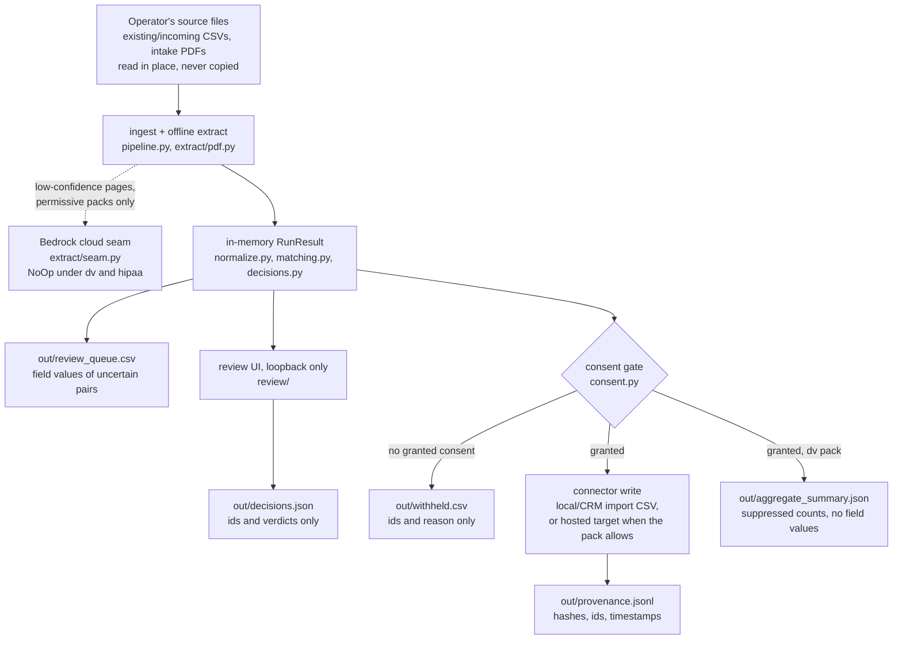

# Data flow and retention

The data-flow map and the per-pack retention and destruction model for
constituent-reconciler. This is the R8 deliverable from
[RESEARCH-ROADMAP.md](./RESEARCH-ROADMAP.md): it names every artifact the
pipeline reads or writes, says which of them hold individual records, and
defines what each policy pack expects an operator to retain and to destroy.

The posture matches [ADOPTION-KIT.md](./ADOPTION-KIT.md): this is a reference
implementation, not legal advice. The model below defines what must be
destroyable and in what order, not how long anything is kept. Retention windows
depend on funding stream, state law, and the adopting organization's own
policies, and are the organization's and its counsel's to set.

Status: model and executor implemented. `reconcile destroy --older-than
<window>` previews or deletes the inventory below and appends content-free
destruction certificates to the provenance chain. No default retention window
ships; the operator and counsel still set it.

## Part 1: the data-flow map

Source data enters through the readers in `pipeline.py`: CSVs via
`read_records`, intake PDFs via `read_pdf_records` and the offline extractor in
`extract/pdf.py`. Inputs are read in place and never copied; the tool holds no
staging copy of the source files. When a recipe opts into the stage cache
(`[cache]` in the recipe, `stage_cache.py`), extraction and normalization
results are stored as content-addressed local files. These are derived field
values rather than copies of the sources, and they are PII artifacts covered
by the destruction inventory below.

Normalization (`normalize.py`), pair scoring (`matching/`), banding,
clustering, and golden-record reduction (`decisions.py`) all happen in memory.
`pipeline.run` returns a value and writes nothing except, when the caller
passes an opted-in stage cache, entries under that cache's local directory;
a dry run passes no cache and still touches no disk. Everything durable lands
in the output directory passed as `--out`, with one bounded exception: the
stage cache lives under `<out>/stage_cache` unless the recipe's `[cache] dir`
names a different local directory as its retention boundary. A URL-shaped
`dir` is refused at recipe load, and under the `dv` pack the default keeps
every retained artifact inside the output root.

Two classes of paths can move data off the machine, and both are policy-gated:

* The optional cloud extraction seam (`extract/seam.py`) may send a
  low-confidence PDF page to Claude via Amazon Bedrock when the recipe enables
  it. Under the `dv` and `hipaa` packs the seam is constructed as a no-op
  before any data flows, enforced by `tests/test_no_egress.py`.
* Hosted write connectors (`civicrm`, `salesforce`, `webhook`, and `airtable`)
  push resolved records to a remote system. Under a pack that requires local
  targets (`dv`), `pipeline.build_connector` refuses them fail-closed.

The review UI (`reconcile review`) serves field values over loopback HTTP for
display, and under the `dv` pack a non-loopback bind is refused. Its only
side effect on disk is `decisions.json`, which carries record ids and verdicts
and no field values (`review/session.py`).

`reconcile compare` (`compare.py`) reads two exports as read-only sources and
writes only into `--out`: the cutover report and review-pair artifacts below
plus a count-only summary and a digest manifest. The command constructs no
connector on any path, so a recipe's `[output]` section cannot cause a write
to either live system; `tests/test_compare.py` enforces that invariant.
Ingest on a compare side is the run pipeline's ingest, so the cloud-seam
rules above apply unchanged: a PDF side whose recipe enables the Bedrock
backend may route low-confidence pages through the policy-gated seam, and the
`dv` and `hipaa` packs fuse it off before any data flows. The compare tests
pin the fused-off seam under the `dv` pack alongside the no-connector
invariant.

Two follow-on commands complete the comparison flow. `reconcile
compare-review` serves the same loopback review UI over the comparison's
undecided pairs; its disk side effects are `compare_decisions.json` (pair ids
and verdicts, no field values) and, when a reviewer corrects a value,
`corrections.json` (which does hold the replacement values). `reconcile
compare-apply` (`compare_apply.py`) then writes `target_corrections.csv`, a
local, import-ready correction file for the target side, only after every
review pair is decided and after the consent gate withholds any identity
without active consent. It refuses when the comparison manifest is missing or
no longer matches the inputs, and it constructs no connector beyond the local
import-file writer; `tests/test_compare_apply.py` enforces the review gate,
the consent gate, and the no-live-connector invariant.

### Artifact inventory

Every artifact below was checked against the writer named for it; nothing in
this table is aspirational. The "written by" column names the module holding
the actual write call, which is not always the module that builds the content:
`ai_ocr_proposals.json` is assembled by `assistant/ocr_propose.py` and written
by `cli.py`, and the writer is what matters when you are tracing where a file
came from.

The table was incomplete once, and the omission was not harmless. Two
artifacts reached the `--out` directory with no row here and no entry in
`destruction.PII_ARTIFACTS`, so `reconcile destroy` exited 0 and issued
destruction certificates while leaving both on disk. Completeness is a test
now rather than a habit: `tests/test_destruction_inventory.py` reads the
package's own source for every filename it builds a path to and fails unless
each is classified in `destruction.py`, and
`tests/test_destruction_leaves_nothing.py` runs the real writers over
sentinel-laced input and fails if any planted field value survives a
destruction pass.

That sweep covers every artifact on `destruction.PII_ARTIFACTS`, not a sample
of them. It drives `run` on three connectors with household grouping and the
stage cache on, `ai-propose-corrections`, `compare`, the comparison review
session, `compare-apply`, `plan-split`, `approve-repair` and `apply-repair
--execute`, and it fails when a name is added to that list without a scenario
exercising it. The two withheld lists are the one exception it states rather
than hides: they carry ids and a reason and no field value, so no sentinel can
appear in them, and they are checked by being written and then deleted.

| Artifact | Written by | Where it lives | Holds individual records? | Notes |
| --- | --- | --- | --- | --- |
| Source CSVs and intake PDFs | the operator; read by `pipeline._ingest_source` | wherever the operator keeps them | Yes | Read in place. Destruction of inputs is the operator's procedure, not the tool's. |
| `review_queue.csv` | `pipeline._write_review_queue` | the `--out` directory | Yes: field values of both records in every uncertain pair, plus source spans when extracted | Written on every `reconcile run`, including `--dry-run`. |
| `household_suggestions.csv` | `pipeline._write_household_suggestions` | the `--out` directory | Yes: the standardized street address and surname shared by one candidate household, plus its member cluster ids | Written only when a recipe sets `[household] enabled = true`; the grouping step is off by default. A suggestion, never a match decision. In the destruction inventory (`destruction.PII_ARTIFACTS`). |
| `resolved.csv` | `connectors/csv_out.py` | the `--out` directory | Yes: golden-record field values, member ids, consent | The default write target. Skipped on `--dry-run`. |
| `civicrm_import.csv`, `salesforce_import.csv` | `connectors/crm_csv.py` | the `--out` directory | Yes: import-shaped field values | Local files, so permitted under the `dv` pack. Skipped on `--dry-run`. |
| Live CRM records | `connectors/civicrm.py`, `connectors/salesforce.py` | the remote CRM | Yes | Non-local; refused fail-closed under the `dv` pack (`pipeline.build_connector`). |
| `repair_plan.json` | `repair.py` via `reconcile plan-split` | the run's `--out` directory, beside the manifest | Yes: proposed split records and restoration values for the members of one written cluster | Local only, never sent anywhere. The provenance log stores its digest, not its content. Regenerable at will from the manifest and sources, so destroying it loses nothing. |
| `repair_receipts.json` | `repair.py` via `reconcile apply-repair` | the run's `--out` directory, beside the manifest | Yes: the before/after raw values of every operation an apply actually performed | Written only on a real (`--execute`) apply, never on a dry run. Unlike the plan file it is not freely regenerable -- it is the record of what was actually written to a live CiviCRM instance -- so it should follow the destination's own retention window rather than being deleted as soon as the repair looks done. The provenance log stores each operation's receipt digest, not its content. |
| `repair_approvals.json` | `repair.py` via `reconcile approve-repair` | the run's `--out` directory, beside the manifest | Ids and names only | Reviewer names, verdicts, and timestamps keyed by the plan digest they approved. The same content class as `decisions.json`'s audit section; not in the destruction inventory for the same reason. |
| `withheld.csv` | `pipeline._write_withheld` | the `--out` directory | Ids only | Cluster id, member record ids, reason. No field values, but ids resolve to people through the organization's own systems. |
| `decisions.json` | `review/session.py` | the `--out` directory | Ids only | Pair ids and verdicts. No field values, by design. |
| `stage_cache/` entry files | `stage_cache.py` via `pipeline.run` | `<out>/stage_cache`, or the recipe's explicit `[cache] dir` boundary | Yes: extracted and normalized field values, keyed by content digest | Written only when a recipe opts in. Covered by `reconcile destroy`; an explicit boundary is covered via `--cache-dir`. |
| `provenance.jsonl` | `provenance.py` | the `--out` directory | No field values | Each entry: BLAKE2b hash of the written payload, record and member ids, consent flag, timestamp, chain hashes. Payloads are referenced by hash, never stored. |
| `aggregate_summary.json` | `pipeline._write_aggregate_summary` over `suppression.py` | the `--out` directory | No | Total and suppressed category counts. Written only under a pack with `aggregate_export` (the `dv` pack), and not on `--dry-run`. |
| `cutover_report.csv` | `compare.write_cutover_report` | the `--out` directory | Yes: per-identity field values from both compared exports, with conflict flags | Written by `reconcile compare` only. In the destruction inventory (`destruction.PII_ARTIFACTS`). |
| `cutover_review.csv` | `compare.write_cutover_review` | the `--out` directory | Yes: field values of the undecided cross-export pairs | Written by `reconcile compare` only. In the destruction inventory. |
| `migration_summary.json` | `compare.write_migration_summary` | the `--out` directory | No | Identity and conflict counts under the versioned `migration_summary` schema; no field values, asserted by `tests/test_compare.py`. |
| `compare_manifest.json` | `compare.write_compare_manifest` | the `--out` directory | No field values | Digests of both recipes and every input file, both column mappings, thresholds. `reconcile compare-apply` adds an `export` section binding the correction and decisions files by digest, with row and withheld counts only. |
| `compare_decisions.json` | `review/session.py` via `reconcile compare-review` | the `--out` directory | Ids only | Pair ids, verdicts, reviewer names, timestamps: the same shape as `decisions.json`. |
| `corrections.json` | `review/session.py` (either review surface) | the `--out` directory | Yes: reviewer-supplied replacement field values | Written only when a reviewer corrects a value during review. In the destruction inventory (`destruction.PII_ARTIFACTS`). |
| `target_corrections.csv` | `compare_apply.export_corrections` | the `--out` directory | Yes: import-shaped golden field values for the target side, plus the target export's own record ids in `target_record_ids` | Written by `reconcile compare-apply` only, after review completeness and the consent gate. In the destruction inventory. |
| `cutover_withheld.csv` | `compare_apply._write_cutover_withheld` | the `--out` directory | Ids only | Identity id, member record ids, withhold reason. Written only when consent withholds an identity from the correction file. In the destruction inventory. |
| `ai_ocr_proposals.json` | `cli._cmd_ai_propose_corrections`, over proposals built by `assistant/ocr_propose.py` | the `--out` directory | Yes: each entry carries the record's raw `original_value`, the model's `proposed_value`, and a `quote` copied verbatim out of the real intake document | Written by `reconcile ai-propose-corrections` only, and never under `dv` or `hipaa`, which disable the assistant package outright. A draft: nothing in it is applied to any record. In the destruction inventory (`destruction.PII_ARTIFACTS`). |
| `ai_usage.json` | `assistant/rate_limit.py`, via any `ai-*` command that calls a provider | the `--out` directory | No | A list of call timestamps backing the per-minute and daily caps. No record id, prompt, or field value. Not in the destruction inventory. |
| `run_manifest.json` | `manifest.py` via `reconcile run` | the `--out` directory | No field values | Input file digests, column mappings, thresholds, and versions, for reproducing a run. |
| `run_summary.json` | `pipeline._write_run_summary` | the `--out` directory | No | Per-stage counts, cache hit counts, and durations; content-free by construction. |
| `run_report.json` | `cli._write_run_report` over `quality.py` | the `--out` directory | No | Run counts plus the per-source data-quality aggregate (completeness, normalization failure rates, consent coverage, duplicate density), already small-cell suppressed under the active policy. |
| `comparable_report.json` | `pipeline._write_comparable_report` over `suppression.py` | the `--out` directory | No | The comparable-database posture's suppressed aggregate. Cell values are integers or the string `suppressed`, never a record id or a field value. |
| `eval/report.md` | `report.py` via `reconcile eval` | the path given to `--out` | No | Match-quality rates on seeded synthetic fixtures; the fixtures contain no real personal data. |
| Terminal output | `report.render_run_summary`, `suppression.render_summary` | the operator's terminal | No | Per-stage counts and the suppressed aggregate. |
| Cloud seam egress | `extract/seam.py` | Amazon Bedrock | Yes, when enabled | Low-confidence PDF pages only. A no-op under `dv` and `hipaa`, asserted by `tests/test_no_egress.py`. |

## Part 2: retention and destruction per policy pack

The model for each pack says which artifacts must be routinely destroyable,
which may be retained, and what triggers destruction. It deliberately does not
set the retention window. "How long" is a counsel and funder question; the
repo's contribution is that when the answer arrives, the artifacts sort cleanly
into destroy and retain with nothing ambiguous between them.

### default

The default pack enforces no confidentiality invariants beyond the ordinary
fail-closed gate (`policy.py`), so retention is governed entirely by the
organization's existing records schedule. The model:

* `review_queue.csv`, `resolved.csv`, the CRM import CSVs, and
  `repair_plan.json` carry the same personal data as the source CRM export
  they came from. Put them under the same schedule as that export, and delete
  the output directory once a run's results have been applied. A repair plan
  in particular should be destroyed as soon as the repair is done or
  abandoned: it concentrates the raw values of the people in a bad merge, and
  it can be regenerated whenever it is needed again. `repair_receipts.json`,
  written only when a repair is actually applied, is not freely regenerable
  the same way: it is the local evidence of a real write to CiviCRM, so
  retain it on the destination's own records schedule rather than deleting it
  as soon as the repair looks done.
* `household_suggestions.csv` (written only when a recipe enables household
  grouping) and `ai_ocr_proposals.json` (written only by `reconcile
  ai-propose-corrections`) belong in the same bucket. The suggestions file
  carries a standardized street address and a surname per candidate household;
  the proposals file carries raw field values and text quoted verbatim out of
  an intake document, and it is a draft nothing was applied from, so there is
  rarely a reason to keep it once a reviewer has acted on it.
* `provenance.jsonl`, `decisions.json`, and `withheld.csv` hold ids and hashes
  rather than field values and may outlive the record artifacts, which is what
  lets the audit trail survive routine cleanup.
* `make clean` removes the demo output directories. It is a developer
  convenience, not a destruction control.

### dv (VAWA and FVPSA)

The HUD HMIS Comparable Database Manual expects individual survivor records to
be routinely destroyed once no longer needed, and NNEDV Safety Net guidance
reads the confidentiality obligations the same way. Both sources are cited with
their limits in [RESPONSIBLE-TECH-AUDITS.md](./RESPONSIBLE-TECH-AUDITS.md) and
[RESEARCH-ROADMAP.md](./RESEARCH-ROADMAP.md). Under this pack the model is:

**Destroy routinely.** The output-directory artifacts that hold individual
records are `review_queue.csv`, `resolved.csv` (or the CRM import CSV when
one is used), and `repair_plan.json` when a split repair was planned. Destroy
them once their purpose is served: the resolved records have landed in the
organization's comparable database, the review decisions have been applied,
and the repair is done or abandoned. The repair plan deserves the shortest
life of the three, because it concentrates the raw values of the survivors
caught in one bad merge and can be regenerated on demand. `repair_receipts.json`
is not reachable under this pack today: `apply-repair --execute` builds its
connector through `pipeline.build_connector`, the same gate `write_all` is
refused under, and the only repair-capable destination (CiviCRM) is
non-local, so `require_local_targets` refuses the connector before any
receipt could be written. If a future local repair-capable destination ever
exists, its receipts belong in this same routine-destroy bucket, for the
same reason the plan does. A migration
comparison's record-bearing artifacts (`cutover_report.csv`,
`cutover_review.csv`, `target_corrections.csv`, and `corrections.json`) follow
the same schedule once the correction file has been imported. The stage-cache
entry files hold extracted and normalized survivor field values and belong on
the same schedule; the destruction command reaches them wherever the recipe
put the cache. `withheld.csv` and `decisions.json` hold record ids without
field values, but those ids resolve to survivors inside the organization's own
systems, so they go on the same destruction schedule, as do
`compare_decisions.json` and `cutover_withheld.csv`.
`household_suggestions.csv` is on this schedule too when a recipe enables
household grouping: a shared address is itself sensitive under this pack, which
is the reason the grouping step ships off by default.
`ai_ocr_proposals.json` is not reachable under this pack at all, for the same
structural reason `repair_receipts.json` is not: the `dv` pack sets
`forbid_cloud_seam`, and `assert_cloud_ai_allowed` refuses every `ai-*` command
before any record is read, so no proposal file can be written. Source intake
files are destroyed under the organization's own intake procedure.

**Retain.** `aggregate_summary.json` may be kept: it is already
non-identifying, small cells are suppressed (`suppression.py`), and it is the
one artifact the pack treats as shareable, so it supports funder reporting
after the record artifacts are gone. `provenance.jsonl` should be kept:
entries reference each written payload by BLAKE2b hash and never store field
values, so the log proves what was written, when, and under which consent
without being able to regenerate a destroyed record. Keep the log local all the
same. It contains record ids, and a hash over a low-entropy payload can in
principle be confirmed by guessing, so the log is evidence for the
organization's own audits, not a shareable artifact.

One consequence of per-entry cache destruction deserves naming here. A cache
entry's destruction certificate records the entry's content-addressed name
and the SHA-256 of the single-record entry file, and both are deterministic
functions of one person's raw field values plus recipe and version
components an insider could know. A holder of the retained provenance log
who also has the recipe can therefore confirm a guessed individual's
presence in a past run, including a person whose record was withheld from
export. This is finer-grained than the whole-file certificates that preceded
the cache, but it is the same exposure class as the content-derived record
ids the log already carries, and it is accepted as a documented tradeoff on
the same terms: the log stays local, per the paragraph above. A salted
certificate scheme is the recorded alternative if a future pack needs to
close this channel.

**Trigger.** What "no longer needed" means differs across VAWA, FVPSA, and
VOCA funding and across states. The pack defines the destroy/retain sort and
the order of operations; the window is counsel-gated, consistent with the
jurisdiction note in [RESEARCH-ROADMAP.md](./RESEARCH-ROADMAP.md).

**Execution.** Run `reconcile destroy --out <directory> --older-than <window>`;
add `--dry-run` first to inspect the eligible inventory. The command deletes
record-bearing artifacts older than the stated policy, including every
stage-cache entry under `<out>/stage_cache`, and appends destruction entries
naming artifact hashes to the provenance chain, so the chain proves
destruction without retaining content. A recipe that placed the cache at its
own `[cache] dir` boundary adds `--cache-dir <that directory>` to the same
command. One honest limit applies: deleting a
file is not forensic erasure on a journaling filesystem. Full-disk encryption
on the machine that runs the tool is the practical mitigation until something
stronger is warranted.

### hipaa

The `hipaa` pack turns on the consent gate and fuses the cloud seam off, and
`policy.py` records that its fuller invariant set is deliberately unspecified.
This document holds to the same line: no HIPAA retention or destruction
obligation is stated here, because the repo's ground rule is that compliance
facts come from the source text, and that verification has not been done for
this pack. Until it is, the operational guidance is conservative: the pack
writes the same artifact shapes as the default pack (it does not emit
`aggregate_summary.json`, since `aggregate_export` is off), so treat every
record-bearing artifact in the inventory as PHI-bearing and apply the covered
entity's own retention schedule to all of it.

## Part 3: the AI assistant layer (opt-in, a second egress path)

[ADR 0014](adr/0014-runtime-ai-at-the-edges.md) added a second place this
codebase can send data off the machine: the opt-in `assistant/` package
(four CLI commands, `ai-explain`/`ai-ask`/`ai-propose-corrections`/
`ai-triage`). It is not part of the flow map in Part 1 above -- nothing in
`pipeline.run`'s data path touches it -- and it is bound by the same
non-egress switch (`policy.forbid_cloud_seam`) the extraction seam already
uses, so the `dv` and `hipaa` packs disable it exactly as they disable that
seam. Under the `default` pack, where it is reachable, `assistant/
consent_filter.py` filters every field through the record's own consent
before any prompt is built, the same gate `consent.partition_by_consent`
applies to export. What is *not* settled by that mechanism: whether sending
a field to a third-party model provider at all fits an adopting
organization's own donor/client consent language and subprocessor
obligations, independent of this project's consent-scope switch. That
question is recorded as a DECISION NEEDED in ADR 0014, not answered here.

## What is enforced versus what is procedure

The flow half of this model is enforced by merge-blocking tests: non-egress
under the `dv` pack and the stage cache's local write boundary
(`tests/test_no_egress.py`), the consent gate (`tests/test_consent.py`),
suppression in the aggregate (`tests/test_suppression.py`), the minimization
of the review artifacts (`tests/test_review.py`), and the comparison flow's
review, consent, and no-live-connector gates (`tests/test_compare.py`,
`tests/test_compare_apply.py`). The destruction executor and its provenance
certificates are enforced by `tests/test_destruction.py`, and cache-entry
destruction by `tests/test_stage_cache.py`; choosing the retention window
remains operator procedure. The AI assistant layer's own non-egress and
consent-filtering gates are enforced by
`tests/test_assistant_consent_filter.py`,
`tests/test_assistant_evidence_payload.py`, and the deterministic
consent-leakage eval in `tools/ai_eval/consent_leakage.py`
(`eval/ai/report.md` §4).
