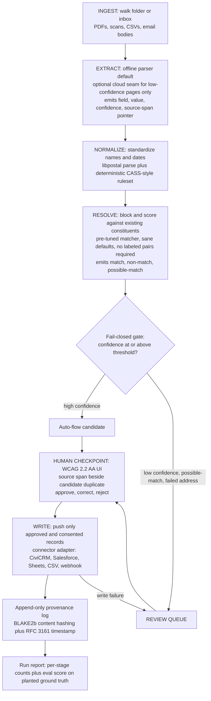

# Roadmap

Planned direction for constituent-reconciler. Dates are intentions, not
promises; items move earlier when users ask for them. Feedback and feature
requests are welcome as GitHub issues.

The sequencing rule for this project: ship the differentiator first with the
least-risky subsystems, then grow the chain outward. The differentiator is a
non-technical review queue over probabilistic matching, plus a privacy mode a
shelter can legally use. The risky parts (document extraction on messy scans,
connector API churn) come after the core has proven out.

## Architecture

A deterministic-by-default state machine with discrete logged steps, explicit
tool calls, and one hard human gate. No silent auto-merge, ever.

## v0.1.0 — Resolve and review, no extraction

The smallest version that ships the differentiator.

* CSV or Sheets in, a pre-tuned matcher backing dedup, a WCAG 2.2 AA review
  queue, CSV out.
* Pre-tuned defaults so the operator supplies no labeled pairs and no blocking
  rules. Confidence gate is fail-closed.
* Committed eval report on seeded synthetic fixtures (zero real PII) with
  planted ground-truth merges and planted near-misses.
* Definition of done: a messy two-source CSV resolves to a reviewed record set,
  the eval report shows false-merge and missed-match rates with Wilson
  confidence intervals, and the false-merge metric is a merge-blocking gate.

## v0.2.0 — One real connector and provenance

* CiviCRM write-back first, because it is fully open, self-hostable, and has no
  vendor gatekeeping for a clean demo.
* Append-only provenance log with BLAKE2b content hashing and RFC 3161
  timestamps.
* Consent as a first-class field; the write step refuses, fail-closed, to emit
  a field whose consent is absent, expired, or revoked.
* Definition of done: a 90-second screencast of messy input becoming records
  that appear in a running CiviCRM instance, with a provenance trail.

## v0.3.0 — The extraction seam

* Offline document extraction (a parser such as Docling or pdfplumber) with
  source-span pointers surfaced in the review UI.
* Optional cloud seam (Claude on Bedrock) for low-confidence pages only, gated
  by the active policy pack.
* If the extraction step uses an LLM judge for field confidence, calibrate it
  against human labels with Cohen's kappa and fail closed on drift.

## v0.4.0 — Address normalization

* libpostal parsing plus a vendored deterministic ruleset.
* Labeled in the output and docs as CASS-style and not USPS-certified.

## v0.5.0 — The DV policy pack

The fundability unlock. A `--policy-pack dv` flag that:

* fuses the cloud seam off so PII never egresses,
* restricts the write step to org-local targets,
* makes exports aggregate and suppression-aware,
* documents the VAWA and FVPSA invariants it enforces, each as a
  merge-blocking test.

## v1.0.0 — Stability commitments

Gated on the pipeline proving out against more than one real organization and
on no breaking change to the connector interface or report schema for two
consecutive releases. Adds a second connector (Salesforce NPSP), one-command
Docker self-host, committed RESPONSIBLE-TECH-AUDITS and a DPG Standard
conformance note, and semantic-versioning guarantees on the config schema, the
connector interface, and the JSON report schema.

## Eval and quality plan

Correctness here is asymmetric, and the eval is built around that.

* A **false merge** corrupts a constituent's history and is sometimes
  irreversible. A **missed match** leaves a duplicate. The first is the worse
  error, so it is the gated one.
* Fixtures are seeded and synthetic, with zero real PII: a record whose name
  varies three ways, a true duplicate split across two scans, a non-duplicate
  that looks like one, an address that fails to parse.
* The eval scores extraction field-level precision and recall, matching
  pairwise precision and recall, and the two asymmetric rates (false-merge,
  missed-match) with Wilson confidence intervals.
* The false-merge rate is a merge-blocking AUTO-GATE in CI.

## Metrics ledger

Per-repo target values. Filled in as phases land; this table is the
conformance record the STANDARDS expect to live here rather than in the
shared standard.

| Attribute | Target | Gate |
|-----------|--------|------|
| Test coverage (logic) | TBD, floor per CODE-QUALITY-STANDARD | AUTO |
| False-merge rate (eval) | TBD threshold, fail-closed | AUTO |
| Matching pairwise precision and recall | TBD, reported with Wilson CIs | REVIEW |
| Extraction field precision and recall | TBD | REVIEW |
| LLM field-judge calibration (Cohen's kappa) | TBD, fail-closed on drift | AUTO |
| Review queue accessibility | WCAG 2.2 AA, axe clean, screen-reader walkthrough | AUTO + REVIEW |
| i18n parity (EN, ES) | key and placeholder parity | AUTO |
| Supply chain | SBOM, Sigstore, SHA-pinned actions, OIDC | AUTO |
| DV policy-pack invariants | PII non-egress, consent-gated write | AUTO |

## Out of scope

* Becoming a CRM or a system of record. The tool writes into existing systems.
* USPS CASS certification (requires licensed USPS data).
* Reimplementing a record-linkage engine. The project wraps an existing
  matcher and contributes defaults, orchestration, and review.
* GTFS, transit, and the other portfolio domains. This is human-services
  constituent data only.

## Open questions to resolve early

Resolve these from primary sources before building the affected phase; do not
guess.

1. Which matcher to wrap (Splink versus dedupe), judged on default quality
   without labeled pairs and on packaging weight for a CI install.
2. The CiviCRM write path: API entity shapes, dedupe-rule interaction, and how
   to make a write idempotent and reversible.
3. The exact VAWA and FVPSA invariants the DV pack must enforce, sourced from
   NNEDV Safety Net guidance, expressed as tests.
4. The output record shape and how far to map toward HSDS organization and
   contact fields and HMIS CSV client fields without overreaching.
5. Whether the review queue is a local web UI or a TUI for the first cut, judged
   on what a non-technical reviewer can actually run.
