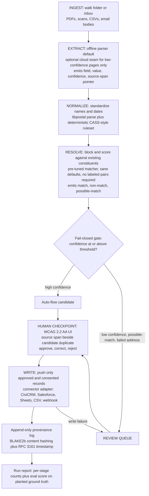

# Roadmap

> **Historical record:** this file preserves the phase plan as built; active multiyear planning lives in [ROADMAP-MULTIYEAR.md](ROADMAP-MULTIYEAR.md).

Planned direction for constituent-reconciler. Dates are intentions, not
promises; items move earlier when users ask for them. Feedback and feature
requests are welcome as GitHub issues.

> **Roadmap closeout (2026-07-22):** repository-owned items in this historical
> roadmap and its research companion have been implemented or given an explicit
> terminal product decision. See [ROADMAP-CLOSEOUT.md](ROADMAP-CLOSEOUT.md) for
> the status ledger and [NOVEL-USE-CASES-PLAN.md](NOVEL-USE-CASES-PLAN.md) for
> the active Now/Next/Later plan. Human and live-system evidence gates remain
> open and are not represented as code work.

The sequencing rule for this project: ship the differentiator first with the
least-risky subsystems, then grow the chain outward. The differentiator is a
non-technical review queue over probabilistic matching, plus a privacy mode a
shelter can legally use. The risky parts (document extraction on messy scans,
connector API churn) come after the core has proven out.

## Architecture

A deterministic-by-default state machine with discrete logged steps, explicit
tool calls, and one hard human gate. No silent auto-merge, ever.

## v0.1.0 — Resolve and review, no extraction

The smallest version that ships the differentiator.

* CSV or Sheets in, a pre-tuned matcher backing dedup, a WCAG 2.2 AA review
  queue, CSV out.
* Pre-tuned defaults so the operator supplies no labeled pairs and no blocking
  rules. Confidence gate is fail-closed.
* Committed eval report on seeded synthetic fixtures (zero real PII) with
  planted ground-truth merges and planted near-misses.
* Definition of done: a messy two-source CSV resolves to a reviewed record set,
  the eval report shows false-merge and missed-match rates with Wilson
  confidence intervals, and the false-merge metric is a merge-blocking gate.

## v0.2.0 — CiviCRM write-back and provenance (shipped)

* CiviCRM write-back via API v4, as an upsert keyed on an external identifier so
  a re-run updates contacts rather than duplicating them. Built on an injected
  transport, so request construction and upsert logic are tested without a live
  server. Chosen first because CiviCRM is fully open and self-hostable.
* A connector interface (`connectors/`) with the CSV writer refactored onto it,
  so destinations stay isolated and a new one is a single module.
* Append-only, tamper-evident provenance log: each write records a BLAKE2b hash
  of the written fields and the previous entry's hash, forming a chain that
  `constituent-reconcile verify` checks. Time comes from a pluggable timestamp authority; the
  default is the local clock, and an RFC 3161 trusted-timestamp authority is the
  seam a production deployment plugs in.
* The consent gate runs before any connector is touched, so non-consented
  records are withheld and never handed to a destination.
* Email and phone now write through the dedicated CiviCRM Email and Phone
  entities rather than the API v4 join-field shorthand (added 2026-07-02): once
  the contact id is resolved, the connector updates the contact's primary
  Email/Phone row when one exists and creates it when none does. A record with
  no value for a field makes no call for it, so an empty value never blanks a
  stored row.
* Still open: a recorded demo of messy input landing in a running CiviCRM
  instance.

## v0.3.0 — The extraction seam (shipped)

* Offline document extraction (pdfplumber) with source-span pointers surfaced
  in the review queue CSV. Each extracted field carries the PDF filename, page
  number, and bounding box so a reviewer can navigate back to the source.
* Policy-gated cloud seam: `CloudSeam` protocol with `NoOpSeam` (default) and
  `BedrockSeam` (the documented extension point for deployers with AWS
  credentials). Under DV and HIPAA policy packs the seam is always `NoOpSeam`
  at construction time; PII cannot egress regardless of recipe settings.
* Folder-based ingestion: `incoming` in the recipe can now point to a directory;
  the pipeline walks it and routes `.csv` files through the structured reader and
  `.pdf` files through the extractor.
* `cohen_kappa()` in `evaluate.py` is the calibration seam for when an LLM
  extraction judge is wired in and its confidence scores are compared against
  human-labeled field accuracy.
* The full `BedrockSeam.refine()` implementation (page-to-image conversion and
  Converse response parsing) has shipped, with a fake-able injected client so
  request, parsing, and fault-tolerance paths are tested without boto3 or
  network access. The WCAG 2.2 AA web review UI subsequently shipped in v0.7.

## v0.4.0 — Address normalization (shipped)

* A vendored, deterministic CASS-style ruleset (`address.py`) standardizes an
  address into USPS-style abbreviations from USPS Publication 28 tables, so two
  writings of the same address ("123 North Main Street" / "123 N Main St") reduce
  to the same matching key. Idempotent, offline, no model.
* Labeled in the code and docs as CASS-style and **not USPS-certified**; the
  standardization shipped position-insensitive, a documented simplification
  retired by the position-aware pass that landed with E6 (see the changelog).
* libpostal is an optional backend (`address_backend = "libpostal"`), never
  required; selecting it without the library installed raises a clear error
  rather than silently falling back.
* Address is added to the canonical schema but a recipe activates it only when it
  maps the field, so the committed demo eval is unchanged (CI verifies this). A
  separate `examples/address-demo/` fixture exercises the field end to end.
* Address agreement is weighted below email and a loose match routes to review,
  because families and shelter residents share an address and people move.

## v0.5.0 — The DV policy pack (shipped)

The fundability unlock. A `--policy-pack dv` flag (or `[policy] pack = "dv"`)
that, as four merge-blocking invariants:

* fuses the cloud seam off so PII never egresses (enforced at seam construction),
* refuses any non-local write target before a write happens, so client data stays
  on the machine (the comparable-database posture),
* emits an aggregate, suppression-aware summary (CMS-style small-cell
  suppression, complementary suppression, true zeros preserved) as the only
  shareable artifact,
* withholds any record without granted consent, recorded by id and reason only.

The invariants are grounded in primary VAWA, FVPSA, and CMS sources, with the
citations and three honesty corrections recorded in
docs/adr/0005-dv-policy-pack.md and docs/RESPONSIBLE-TECH-AUDITS.md. The
`policy.py` model maps a pack name to its invariants and fails closed on an
unknown name. `hipaa` is a partial pack (consent plus no cloud seam) and does not
claim the DV local-target and aggregate rules.

## v0.6.0 — The v1.0 engineering deliverables (shipped)

The concrete build items of the 1.0 milestone, shipped without the 1.0 tag,
because the tag itself is gated on adoption (see below):

* A second connector, **Salesforce NPSP**, on the same `Connector` interface and
  injected-transport pattern as CiviCRM, using the REST upsert-by-external-id
  endpoint. Proves the connector interface is real, not a one-off.
* **One-command Docker self-host** (`Dockerfile`, `make docker`), with the PDF
  extraction extra included.
* A **DPG Standard conformance note** (`docs/DPG-CONFORMANCE.md`) mapping the
  project against the nine indicators, honestly.
* **Declared schema and interface versions** (`schema.py`, `constituent-reconcile schema`)
  for the config, the connector interface, and the JSON artifacts, with the
  versioning contract in docs/adr/0006-schema-stability.md.

## v0.7.0 — Web review UI and offline CRM export (shipped)

The differentiator's review surface, and the offline-first write path, two items
the 1.0 milestone named.

* **Local WCAG 2.2 AA web review queue** (`review/`, `constituent-reconcile review`): a
  non-technical reviewer steps through the uncertain pairs in a browser, sees the
  two records side by side with source spans, and approves or rejects each merge.
  Verdicts write to the same `decisions.json` that `constituent-reconcile apply` consumes, so
  the web step replaces the hand-edited CSV without changing the pipeline. Built
  on `http.server`, no web-framework dependency.
* **Offline by construction**: loopback-only bind, all assets inlined, and under
  the DV pack a non-loopback bind is refused fail-closed (mirroring the connector
  local-target gate). The only persisted artifact is `decisions.json` with ids and
  verdicts and no field value, the minimization the DV pack requires.
* **Import-ready CRM export connectors** (`salesforce_csv`, `civicrm_csv`): a CSV
  mapped to the CRM's import schema plus an external-id column for an idempotent
  CRM-side upsert. The offline-first default path; the live API push stays opt-in.
  Both are local-file targets, so the DV pack permits them.
* Still open before the 1.0 accessibility gate: a screen-reader walkthrough.
  The structural AA work (table semantics, non-colour status,
  keyboard-complete controls, no-JS fallback) is in place, and an automated
  axe-core audit of the review queue's rendered HTML now runs as a CI job
  (`accessibility` in `.github/workflows/ci.yml`; `make axe` locally; see
  docs/adr/0011-automated-axe-audit.md). The walkthrough is a manual
  pass with real assistive technology, tracked with a checklist in
  docs/reviews/SCREEN-READER-WALKTHROUGH.md, not yet performed.

## v1.0.0 — Stability commitments

Gated on the pipeline proving out against more than one real organization and on
no breaking change to the named surfaces for two consecutive releases. The
engineering deliverables landed in v0.6 and the web review UI in v0.7. The
supply-chain implementation has also landed: SBOM generation, keyless build
provenance, SHA-pinned Actions, and security scans. What remains for the 1.0 tag
is adoption evidence, the demonstrated-stability window, human
accessibility/i18n evidence, and exercising the release workflow with a first
`v*` tag; a live `protect-main` ruleset has been active since 2026-07-09,
with its remaining delta from the committed profile recorded in
docs/rulesets/README.md. The tag is deliberately withheld until
those are real: 1.0 means a stability promise, and a promise that depends on
adoption cannot be made by a release script.

## Eval and quality plan

Correctness here is asymmetric, and the eval is built around that.

* A **false merge** corrupts a constituent's history and is sometimes
  irreversible. A **missed match** leaves a duplicate. The first is the worse
  error, so it is the gated one.
* Fixtures are seeded and synthetic, with zero real PII: a record whose name
  varies three ways, a true duplicate split across two scans, a non-duplicate
  that looks like one, an address that fails to parse.
* The eval scores extraction field-level precision and recall, matching
  pairwise precision and recall, and the two asymmetric rates (false-merge,
  missed-match) with Wilson confidence intervals.
* The false-merge rate is a merge-blocking AUTO-GATE in CI.

## Metrics ledger

Per-repo target values. Filled in as phases land; this table is the
conformance record the STANDARDS expect to live here rather than in the
shared standard.

| Attribute | Target | Gate | Measured by | Owner |
|-----------|--------|------|-------------|-------|
| Test coverage (logic) | At least 85% branch coverage on `src/`; observed 87.65% on 2026-07-12 | AUTO | `make test` coverage report (`--cov-fail-under=85`), run by the CI `verify` job | maintainer |
| False-merge rate (eval) | 0% among auto-merged pairs on the committed fixtures, fail-closed; CI runs the gate at 0.0 | AUTO | `make eval` plus the committed-report drift check in the CI `verify` job | maintainer |
| Matching pairwise precision and recall | Auto-merge precision 100% (a false merge fails the gate); auto+review coverage recall at least 95%, reported with Wilson CIs | REVIEW | `eval/report.md`, regenerated by `make eval`, drift-gated in CI | maintainer |
| Extraction field precision and recall | At least 0.95 precision and 0.90 recall on the committed labeled fixture; observed 1.00 precision and 0.941 recall in `eval/extraction-report.md` | REVIEW | `eval/extraction-report.md`, regenerated by `make eval-extraction`, drift-gated in CI | maintainer |
| Matching risk-class coverage | Disaggregate transliterated, hyphenated/punctuated, non-Western-order, rural-route, and informal-address planted pairs; preserve misses in the committed report | REVIEW | `docs/audits/bias-report.md`, regenerated by `make eval-bias`, drift-gated in CI | maintainer |
| LLM field-judge calibration (Cohen's kappa) | Kappa at least 0.60, fail-closed on drift, the 0.6 line `evaluate.cohen_kappa` documents; wired into the eval in R10 | AUTO | `make eval` calibration gate (`evaluate.cohen_kappa`) | maintainer |
| Review queue accessibility | WCAG 2.2 AA; axe clean (automated, `accessibility` CI job, 2026-07-07) and screen-reader walkthrough (manual, not yet performed — docs/reviews/SCREEN-READER-WALKTHROUGH.md) | AUTO + REVIEW | CI `accessibility` job (axe over rendered pages); the manual half is unmeasured until the walkthrough is performed | maintainer |
| i18n parity (EN, ES) | key and placeholder parity | AUTO | Narrative report: shared `_STRINGS` key table with EN/ES tests (`tests/test_narrative.py`). The full UI catalog is not yet extracted, so parity beyond the narrative strings is unmeasured (docs/I18N.md) | maintainer |
| Supply chain | SBOM, Sigstore, SHA-pinned actions, OIDC | AUTO | `release.yml` (SBOM + attestation on tag), `zizmor` CI job, pinned-action review | maintainer |
| DV policy-pack invariants | PII non-egress, consent-gated write | AUTO | `tests/test_no_egress.py` and `tests/test_consent.py` in the CI `verify` job | maintainer |
| Source hygiene | Zero debt markers; every suppression coded and explained | AUTO | `make hygiene` (tools/hygiene.py) inside `make verify`, and `tests/test_hygiene.py` | maintainer |

This repository has one maintainer, so every Owner cell reads "maintainer"
today; the column exists so that a second contributor inherits explicit
ownership rows rather than an assumption.

### DORA, at solo scale

Reviewed quarterly, computed from `gh` CLI queries rather than a dashboard,
because four numbers a solo repo can compute in one command gain nothing from
automation. Deployment frequency: release tags pushed (currently zero; no
release has been tagged, see the tagging item in the audit remediation).
Lead time for changes: PR open-to-merge from
`gh pr list --state merged --json createdAt,mergedAt`. Change failure rate:
post-merge fix commits referencing a prior PR. Time to restore: not
applicable until an operational deployment exists; recorded as N/A rather
than invented. First review falls due with the first tagged release.

Enforcement today: the false-merge, calibration, coverage, source-hygiene,
and DV policy-pack
invariants run in merge-blocking tests. CI regenerates the aggregate matching,
extraction, and disaggregated bias reports and fails on any committed-report
drift. The branch-coverage gate is the documented 85% target.
Secret/dependency scans, Semgrep, CodeQL, zizmor, Trivy, and the automated axe
audit run in CI; the release workflow generates a CycloneDX SBOM and keyless
build-provenance attestation. A live `protect-main` ruleset has required the
CI check contexts on merges to `main` since 2026-07-09; its remaining delta
from the committed profile (no pull-request or linear-history rule live yet,
non-strict up-to-date policy) is recorded in docs/rulesets/README.md.
Matching/extraction precision and the
risk-class rows remain REVIEW metrics rather than pass/fail gates; the report
therefore preserves the measured transliterated-name and non-Western-order
misses instead of tuning the fixture until it is green.

## AI Evaluation Standard applicability

`AI-Evaluation-Standard: Applies — opt-in Bedrock and local-model extraction
seams; deterministic matching remains outside model inference. Reviewed
2026-07-12.` `BedrockSeam.refine()` is implemented; the default backend is
still `none`, and the DV and HIPAA packs fuse cloud inference off. Binding
controls now include model/data cards, a fail-closed kappa gate, mocked contract
and fallback tests, and canonical PII-free GenAI token/duration/cost telemetry.
There is no live hosted-model accuracy claim: an adopting organization must
benchmark its selected model on representative local documents.

## Observability

Tier C (library/CLI): `constituent-reconcile` is a local command-line pipeline and a
loopback-only review server, not a hosted service, so there is no request-rate,
latency-SLO, or distributed-tracing surface for OTel/RUM tiers A or B to apply
to. What Tier C asks for:

* **Logging posture:** human-readable stdout/stderr for deterministic pipeline
  stages. Optional Bedrock/local model calls additionally emit one structured
  `genai_call` record using the pinned portfolio shim; the review server still
  suppresses per-request access logging (`review/server.py`).
* **No secrets or PII in logs:** enforced by construction, not just convention —
  `decisions.json` carries ids and verdicts only, `withheld` records are logged
  by id and reason only, and provenance entries store BLAKE2b hashes rather than
  raw field values, each backed by a merge-blocking test
  (`tests/test_consent.py`, `tests/test_provenance.py`, `tests/test_review.py`).
* **Model-call telemetry:** an optional span factory receives canonical
  OpenTelemetry GenAI attributes. The same call records input/output tokens,
  duration, an allowlisted finish reason, and estimated cost without page,
  prompt, response, filename, exception detail, field, or record content.
  Telemetry exporter failures are isolated from provider results. RUM and
  hosted-service request SLOs remain N/A.

## Out of scope

* Becoming a CRM or a system of record. The tool writes into existing systems.
* USPS CASS certification (requires licensed USPS data).
* Reimplementing a record-linkage engine. The project wraps an existing
  matcher and contributes defaults, orchestration, and review.
* GTFS, transit, and the other portfolio domains. This is human-services
  constituent data only.

## Open questions to resolve early

Resolve these from primary sources before building the affected phase; do not
guess.

1. Which matcher to wrap (Splink versus dedupe), judged on default quality
   without labeled pairs and on packaging weight for a CI install.
2. The CiviCRM write path: API entity shapes, dedupe-rule interaction, and how
   to make a write idempotent and reversible. The dedupe-rule interaction (for
   CiviCRM and Salesforce/NPSP both) is now documented in
   [CRM-DEDUPE-COOPERATION.md](./CRM-DEDUPE-COOPERATION.md).
3. The exact VAWA and FVPSA invariants the DV pack must enforce, sourced from
   NNEDV Safety Net guidance, expressed as tests.
4. The output record shape and how far to map toward HSDS organization and
   contact fields and HMIS CSV client fields without overreaching.
5. Whether the review queue is a local web UI or a TUI for the first cut, judged
   on what a non-technical reviewer can actually run.
